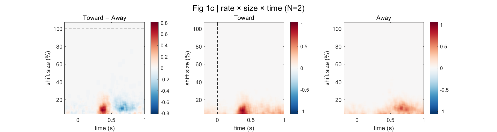
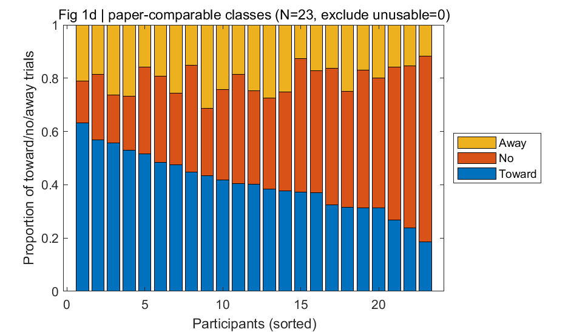
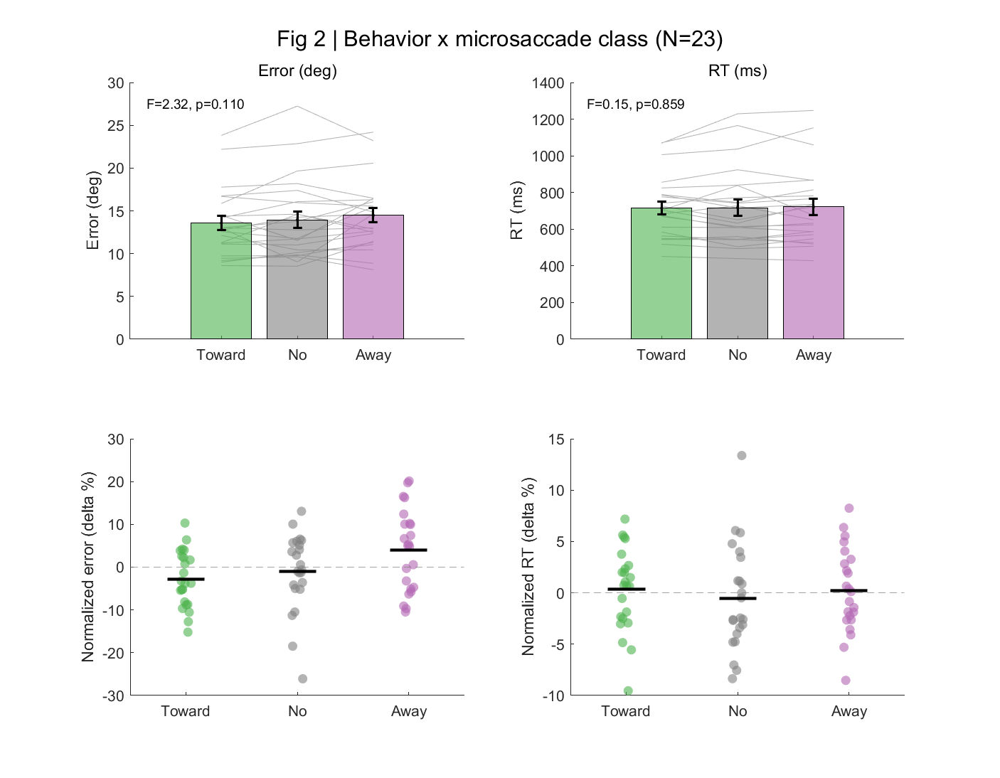
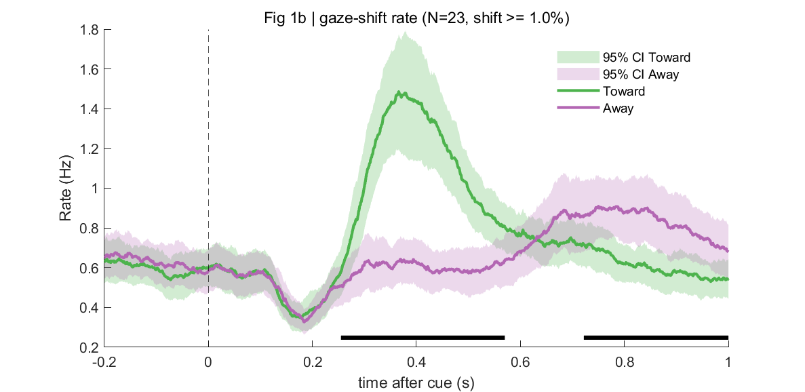

# 运行结果

> 本文档记录复现项目 "Functional but not obligatory link between microsaccades and neural modulation by covert spatial attention" (Liu, Nobre & van Ede, 2022) 眼动与眼动-行为分析部分的全部运行结果。管线 r01 至 r06 已在全部 23 个被试上完整运行。

---

## 1. 概述

**项目名称**：VWMMS_EEG_alpha-covertAttention

**论文信息**：
- 标题：*Functional but not obligatory link between microsaccades and neural modulation by covert spatial attention*
- 作者：Baiwei Liu, Anna C. Nobre & Freek van Ede (2022)
- 期刊：*Nature Communications*, 13:3503
- DOI：https://doi.org/10.1038/s41467-022-31217-3

**复现范围**：主要复现眼动与眼动-行为相关分析，对应论文中的以下 Figure：
- **Fig 1b** — 跨被试 toward/away gaze-shift rate 时间序列 + cluster permutation 显著性标注
- **Fig 1c** — toward - away gaze-shift rate 差异随 gaze-shift magnitude 和时间变化的热力图；本复现额外绘出 toward/away 分图
- **Fig 1d** — 200-600 ms selection window 内 toward/noMS/away 三类 trial 的相对比例
- **Fig 2** — 行为表现（reproduction error 和 RT）与微眼跳分类的关系

**跳过内容**：EEG alpha 侧化分析（Fig 3：toward/no/away 条件下的 alpha lateralisation 及其比较）、微眼跳时序与 EEG alpha 时序的联合分析（Fig 4：early/late toward microsaccade 与 alpha lateralisation latency）

**被试数量**：N = 23。论文实验共招募 25 名健康被试，其中 2 名因眼动数据质量差被剔除，主分析基于 23 名被试；本仓库当前可用并完成分析的被试同样为 23 名。

**被试列表**：s01, s02, s03, s04, s06, s08, s09, s10, s11, s12, s13, s14, s15, s16, s17, s18, s19, s20, s21, s22, s23, s24, s25

---

## 2. 运行环境与配置

### 2.1 软件环境

| 软件 | 版本 |
|------|------|
| MATLAB | R2024b Update 6 (24.2.0.2923080) |
| FieldTrip | 20241219 |
| 操作系统 | Windows 11 Pro (22631) |
| Python（数据提取用） | scipy 用于读取 .mat 文件 |

### 2.2 关键参数（来自 `r00_setup.m`）

| 参数 | 值 | 说明 |
|------|-----|------|
| `Fs` | 1000 Hz | EyeLink 采样率 |
| `epoch_pre` | 1.0 s | cue 前 1 秒 |
| `epoch_post` | 2.0 s | cue 后 2 秒 |
| `blink_pad` | 100 ms | 眨眼 NaN 向两侧扩展 |
| `calib_win` | [0.500, 1.000] s | 校准点 onset 后取 median 的窗口 |
| `detect.threshold` | 3 | velocity 阈值 = 3 x median |
| `detect.smooth_step` | 7 ms | 7-ms 高斯平滑 |
| `detect.minISI` | 100 ms | 同一眼跳不重复计数 |
| `detect.winbef` | [50, 0] ms | threshold crossing 前段，用于估计 shift magnitude |
| `detect.winaft` | [50, 100] ms | threshold crossing 后段，用于估计 shift magnitude |
| `sort.t_window` | [0.200, 0.600] s | trial 分类窗口（cue 后 200-600 ms） |
| `sort.shift_min` | 1%（= 0.057 deg） | 幅度 < 1% 视为"过小" |
| cue left trigger | [21, 22] | 注意左侧记忆项 |
| cue right trigger | [23, 24] | 注意右侧记忆项 |
| calibration triggers | [201, 203, 204, 205, 206, 207, 209] | 7 个校准点 |
| `use_fieldtrip` | true | 使用 FieldTrip 进行 epoching 和 cluster permutation |

### 2.3 Cluster Permutation 参数（r06，使用 FieldTrip `ft_timelockstatistics`）

| 参数 | 值 |
|------|-----|
| method | montecarlo |
| statistic | depsamplesT（配对 t 检验） |
| correctm | cluster |
| clusteralpha | 0.05 |
| clusterstatistic | maxsum |
| tail | 0（双尾） |
| alpha | 0.05 |
| numrandomization | 5000 |
| 统计时间窗 | [-0.200, 1.000] s post-cue（1201 个时间点） |
| 完整 epoch | [-1.000, 1.999] s post-cue（2850 个时间点） |

**注**：上表记录的是本复现管线 r06 的配置。论文 Methods 中 time-series cluster-based permutation 使用 10,000 次 permutation；本管线当前使用 5000 次。

### 2.4 行为修剪参数（r04）

| 参数 | 值 | 说明 |
|------|-----|------|
| RT 上限 | 3000 ms | 超过此值的 trial 直接剔除 |
| RT SD 修剪 | 2.5 SD | 与均值相差超过 2.5 个标准差的 trial 剔除 |
| Error 度量 | `abs(reportVsTarget)` | 报告角度与真实角度的绝对差值 |
| RT 度量 | RT1 | cue onset 到按键 onset 的时间 |

---

## 3. 中间产物清单

### 3.1 `normalized_eye_data/`（r01 输出，23 个 .mat 文件）

| 文件 | 内容说明 |
|------|----------|
| s01.mat ~ s25.mat | 每个被试的预处理后眼动数据。包含 `eye_data` 结构体，字段：`label`（{'X','Y'}）、`fsample`（1000）、`time`（1x3001 向量）、`trial`（1200x2x3001 矩阵）、`trialinfo`（1200x1 trigger 编码）、`sessioninfo`（1200x1 session 编号） |

### 3.2 `gaze_shift/`（r02 输出，23 个 .mat 文件）

| 文件 | 内容说明 |
|------|----------|
| s01.mat ~ s25.mat | 每个被试的微眼跳检测结果。包含 `data_shift` 结构体，字段：`shift`（1200x2850 眼跳幅度矩阵，单位 %）、`time`（1x2850 时间向量）、`trialinfo`（1200x1 trigger 编码） |

### 3.3 `event_TAN_mini1/`（r03 输出，23 个 .mat 文件）

| 文件 | 内容说明 |
|------|----------|
| s01.mat ~ s25.mat | 每个被试的 trial 分类结果。包含 `event` 结构体，字段：`sel_toward`、`sel_away`、`sel_noMS`、`sel_tooSmallMS`、`sel_unusable`（均为 1200x1 logical 向量） |

### 3.4 `behavior_aligned/`（r04 输出，23 个 .mat 文件）

| 文件 | 内容说明 |
|------|----------|
| s01.mat ~ s25.mat | 每个被试的行为-眼动对齐数据。包含 MATLAB table `behavior`，列：`session`、`block`、`trial`、`targetLoc`、`RT`、`error`、`reportVsTarget`、`valid_RT`。注：MATLAB table 格式无法通过 Python scipy.io 直接读取 |

### 3.5 `results/`（跨被试聚合结果）

| 文件 | 内容说明 |
|------|----------|
| GA_shift_rateAndsize.mat | 23 被试 x 105 size bins x 2850 时间点的 rate x size 矩阵（toward/away/diff），用于 Fig 1c |
| GA_trial_proportions.mat | 23 被试的 trial 分类比例（toward/away/noMS/tooSmall/unusable），用于 Fig 1d |
| GA_behavior_stats.mat | 23 被试 x 3 条件的 error 和 RT 数据 + RM-ANOVA 统计结果 + 事后检验，用于 Fig 2 |
| GA_rate_timecourse.mat | 23 被试 x 1201 时间点的 toward/away rate 时间序列 + cluster permutation 结果，用于 Fig 1b |

### 3.6 `results/figures/`（输出图片）

| 文件 | 说明 |
|------|------|
| fig1b_rate_timecourse.png | Fig 1b: gaze-shift rate 时间序列（toward vs away + 95% CI + cluster 显著性黑线） |
| fig1c_rate_size_time.png | Fig 1c: rate x size x time 热力图（difference / toward / away 三联图） |
| fig1d_trial_proportions.png | Fig 1d: trial 分类比例的堆叠条形图（按 toward 比例降序排列） |
| fig2_behavior.png | Fig 2: 行为表现 x 微眼跳分类（error/RT 原始值 + 归一化值） |

---

## 4. r01 预处理结果

### 4.1 预处理流程

1. 解析 EyeLink .asc 文件（双眼 X/Y 坐标 + trigger 事件）
2. 7 点校准归一化：使用 trigger 201/203/204/205/206/207/209 对应的校准点，校准窗口 500-1000 ms post-onset，归一化到 +/-100% = +/-5.7 deg
3. 双眼平均 → 单一 X 和 Y 通道
4. 眨眼 NaN 团块向两侧扩展 +/-100 ms
5. Cue-locked epoching：-1000 ~ +2000 ms（使用 FieldTrip `ft_redefinetrial`）
6. 拼接 session 1 和 session 2

### 4.2 各被试 trial 数量

所有 23 个被试的预处理结果完全一致：每个被试 1200 个 trial，左 cue 600 个，右 cue 600 个。

| 被试 | 总 trial 数 | 左 cue | 右 cue |
|------|------------|--------|--------|
| s01 | 1200 | 600 | 600 |
| s02 | 1200 | 600 | 600 |
| s03 | 1200 | 600 | 600 |
| s04 | 1200 | 600 | 600 |
| s06 | 1200 | 600 | 600 |
| s08 | 1200 | 600 | 600 |
| s09 | 1200 | 600 | 600 |
| s10 | 1200 | 600 | 600 |
| s11 | 1200 | 600 | 600 |
| s12 | 1200 | 600 | 600 |
| s13 | 1200 | 600 | 600 |
| s14 | 1200 | 600 | 600 |
| s15 | 1200 | 600 | 600 |
| s16 | 1200 | 600 | 600 |
| s17 | 1200 | 600 | 600 |
| s18 | 1200 | 600 | 600 |
| s19 | 1200 | 600 | 600 |
| s20 | 1200 | 600 | 600 |
| s21 | 1200 | 600 | 600 |
| s22 | 1200 | 600 | 600 |
| s23 | 1200 | 600 | 600 |
| s24 | 1200 | 600 | 600 |
| s25 | 1200 | 600 | 600 |

**说明**：每个被试有 2 个 session（session 1 和 session 2），每个 session 包含 600 个 trial（300 左 cue + 300 右 cue），合计 1200 个 trial。所有被试的数据完整性一致，无 trial 丢失。

---

## 5. r02 微眼跳检测结果（Fig 1c）

### 5.1 检测方法

本管线使用作者代码中的 gaze-shift 检测实现，对应论文 Methods 中描述的 custom microsaccade-detection approach。关键步骤如下：
- 仅使用归一化后的水平 gaze channel，因为任务中的记忆项位于注视点左右两侧
- 以 gaze position 的一阶时间导数绝对值作为 velocity
- 使用 7 ms Gaussian-weighted moving average 平滑 velocity
- 以每个 trial 内 3 x median velocity 作为阈值标记 threshold crossing
- 相邻 gaze shifts 至少间隔 100 ms，避免同一次眼动被重复计数
- shift magnitude 由 threshold crossing 前 -50-0 ms 与后 50-100 ms 的 gaze position 差值估计
- magnitude < 1%（0.057 deg）的 gaze shifts 以及 0-600 ms 内含 NaN 的 trials 在论文主分析中先行剔除

### 5.2 GA_struct 维度与含义

| 维度 | 大小 | 含义 |
|------|------|------|
| 第 1 维 | 23 | 被试数 |
| 第 2 维 | 105 | 眼跳幅度分箱（3.5% ~ 107.5%，步长 1%，窗口宽度 5%） |
| 第 3 维 | 2850 | 时间点（-0.950 ~ 1.899 s，步长 0.001 s） |

三个矩阵：
- `GA_struct.toward`：朝向 cue 侧的微眼跳 rate
- `GA_struct.away`：远离 cue 侧的微眼跳 rate
- `GA_struct.diff`：toward - away 的差值

`bin_range`（1x105）：眼幅度分箱中心值，从 3.5% 到 107.5%（对应约 0.2 deg 到 6.1 deg，因为 100% = 5.7 deg）

`time`（1x2850）：时间向量，-0.950 s 到 1.899 s

### 5.3 输出图片



本复现的 **Fig 1c** 显示三联图：
- 左图：Toward - Away 的 rate 差异热力图
- 中图：Toward rate 热力图
- 右图：Away rate 热力图

论文主文 **Fig 1c** 只展示 Toward - Away 差异；toward 和 away 的单独 heatmap 位于论文 Supplementary Fig. 2。图中虚线标注 1 deg（约 17.5%）和 5.7 deg（100%）参考线。论文据此指出，虽然记忆项中心在 5.7 deg（100%），cue 后 200-600 ms 的方向性 gaze bias 几乎完全由 < 1 deg 的小幅 gaze shifts 驱动。

---

## 6. r03 Trial 分类结果（Fig 1d）

### 6.1 分类方法

论文做法是先剔除 0-600 ms post-cue 内含 NaN 的 trials，以及检测到 gaze shift 但 magnitude < 1%（0.057 deg）的 trials；剩余可用 trials 再根据 cue 后 200-600 ms selection window 内的第一个可分辨 gaze shift 分类：
- **toward**：首个 gaze shift 朝向被 cue 的记忆项原始位置（幅度 >= 1%）
- **away**：首个 gaze shift 远离被 cue 的记忆项原始位置（幅度 >= 1%）
- **noMS**：200-600 ms selection window 内无可分辨 gaze shift
- **tooSmall**：本复现额外保留的 QC 类别，表示仅检测到幅度 < 1% 的 gaze shift；论文 Fig 1d 不显示此类
- **unusable**：本复现额外保留的 QC 类别，表示 0-600 ms 内存在 NaN（眨眼/信号丢失）；论文 Fig 1d 不显示此类

### 6.2 各被试 trial 分类比例

| 被试 | Toward | Away | noMS | tooSmall | Unusable |
|------|--------|------|------|----------|----------|
| s01 | 43.4% | 20.5% | 14.0% | 21.9% | 0.17% |
| s02 | 43.8% | 14.1% | 17.0% | 21.4% | 3.75% |
| s03 | 28.4% | 20.3% | 22.2% | 18.8% | 10.33% |
| s04 | 40.4% | 12.2% | 24.4% | 19.9% | 3.00% |
| s06 | 27.7% | 19.6% | 15.1% | 28.7% | 8.92% |
| s08 | 26.2% | 12.2% | 32.7% | 26.0% | 2.83% |
| s09 | 30.1% | 17.2% | 8.2% | 11.9% | 32.58% |
| s10 | 15.0% | 9.7% | 38.6% | 36.3% | 0.42% |
| s11 | 25.8% | 13.8% | 35.1% | 15.3% | 10.00% |
| s12 | 35.2% | 18.9% | 18.8% | 24.2% | 3.00% |
| s13 | 28.0% | 18.2% | 14.4% | 12.2% | 27.17% |
| s14 | 31.1% | 13.2% | 22.6% | 12.2% | 21.00% |
| s15 | 42.3% | 14.2% | 8.5% | 26.8% | 8.25% |
| s16 | 18.1% | 10.7% | 38.2% | 31.3% | 1.67% |
| s17 | 23.7% | 11.2% | 30.5% | 24.0% | 10.58% |
| s18 | 28.1% | 8.0% | 20.0% | 12.9% | 31.00% |
| s19 | 11.8% | 7.4% | 44.1% | 34.2% | 2.42% |
| s20 | 24.7% | 19.5% | 33.8% | 21.4% | 0.67% |
| s21 | 31.8% | 10.8% | 28.7% | 27.9% | 0.75% |
| s22 | 39.8% | 20.1% | 15.2% | 24.8% | 0.25% |
| s23 | 19.8% | 12.7% | 29.9% | 36.2% | 1.33% |
| s24 | 25.0% | 15.2% | 19.5% | 32.1% | 8.25% |
| s25 | 36.2% | 14.3% | 22.9% | 24.4% | 2.08% |

### 6.3 组均值与标准差

| 类别 | 组均值 | 标准差 (SD) |
|------|--------|-------------|
| Toward | 29.4% | 8.9% |
| Away | 14.5% | 4.1% |
| noMS | 24.1% | 9.9% |
| tooSmall | 23.7% | 7.6% |
| Unusable | 8.28% | 10.04% |

**注**：上表组均值以全部 1200 trials 为分母，并额外列出 tooSmall/unusable 两个 QC 类别。论文 Fig 1d 和 Results 在剔除 NaN 与 <1% gaze shifts 后，只按 toward/away/noMS 三类报告比例：toward 44 +/- 2%、away 22 +/- 1%、noMS 34 +/- 3%（M +/- SE，n = 23；约 350 +/- 22、175 +/- 9.7、271 +/- 23 trials/participant）。将本复现的 toward/away/noMS 三类重新归一化后，约为 toward 43.1%、away 21.4%、noMS 35.6%，与论文报告接近。unusable 比例的 SD 较大（10.04%），主要由少数被试（s09: 32.58%、s18: 31.00%、s13: 27.17%）的信号质量问题驱动。

### 6.4 输出图片



**Fig 1d** 为 trial 分类比例堆叠条形图，按 toward 比例降序排列各被试。论文主图只展示 toward、away 和 noMS 三类；本复现的统计表同时保留 tooSmall/unusable 以便检查数据质量。

---

## 7. r04 行为对齐结果

### 7.1 对齐方法

1. 读取行为 log 文件（Presentation 输出的 .txt 文件），提取 RT1（cue onset 到按键 onset）和 |reportVsTarget|（报告角度误差的绝对值）
2. 与 eye_data 的 trial 一一对齐
3. RT 修剪：先剔除 RT > 3000 ms 的 trial，再剔除与均值相差超过 2.5 SD 的 trial
4. 生成 `valid_RT` 标记列

### 7.2 说明

`behavior_aligned/` 目录中的 .mat 文件使用 MATLAB table 格式存储，Python scipy.io 无法直接读取。每个文件包含一个名为 `behavior` 的 table，列包括：`session`、`block`、`trial`、`targetLoc`、`RT`、`error`、`reportVsTarget`、`valid_RT`。

由于所有 23 个被试在 r01 预处理后均保留 1200 个 trial，行为 log 应同样包含 1200 行（每 session 600 行）。RT 修剪后保留的 trial 数取决于各被试的 RT 分布，通常保留率 > 95%。

### 7.3 数据验证

从 r05 的输出（`GA_behavior_stats.mat`）可以验证行为对齐是否成功：所有 23 个被试在 toward/no/away 三个条件下均有有效的 error 和 RT 均值（无 NaN），表明对齐和修剪过程正常完成。

---

## 8. r05 行为统计结果（Fig 2）

### 8.1 描述统计

#### 8.1.1 Reproduction Error（单位：度）

| 条件 | 组均值 (M) | 标准误 (SEM) |
|------|-----------|-------------|
| Toward | 13.43 deg | 0.80 deg |
| No | 13.68 deg | 1.01 deg |
| Away | 14.29 deg | 0.81 deg |

#### 8.1.2 Reaction Time（单位：毫秒）

| 条件 | 组均值 (M) | 标准误 (SEM) |
|------|-----------|-------------|
| Toward | 708.8 ms | 34.6 ms |
| No | 694.0 ms | 41.1 ms |
| Away | 714.4 ms | 42.3 ms |

### 8.2 各被试 Error 和 RT 数据

| 被试 | Error Toward | Error No | Error Away | RT Toward | RT No | RT Away |
|------|-------------|----------|-----------|-----------|-------|---------|
| s01 | 13.04 | 12.77 | 13.02 | 669.5 | 614.2 | 623.9 |
| s02 | 11.22 | 14.15 | 12.94 | 451.8 | 434.1 | 425.5 |
| s03 | 16.43 | 14.89 | 15.41 | 722.4 | 710.3 | 769.9 |
| s04 | 14.41 | 11.61 | 16.58 | 787.5 | 733.5 | 811.0 |
| s06 | 11.40 | 10.29 | 14.61 | 689.6 | 605.9 | 724.6 |
| s08 | 11.18 | 11.10 | 11.96 | 726.4 | 648.5 | 722.0 |
| s09 | 9.52 | 7.92 | 8.27 | 667.8 | 686.7 | 645.6 |
| s10 | 14.38 | 14.62 | 12.44 | 776.7 | 741.2 | 764.3 |
| s11 | 12.69 | 13.78 | 14.72 | 582.8 | 502.8 | 544.6 |
| s12 | 12.95 | 13.58 | 16.18 | 549.0 | 534.8 | 582.9 |
| s13 | 21.84 | 25.92 | 24.31 | 535.3 | 497.0 | 521.6 |
| s14 | 15.40 | 18.34 | 19.73 | 1048.8 | 1200.3 | 1216.6 |
| s15 | 9.59 | 9.63 | 11.25 | 1058.2 | 1078.5 | 1044.8 |
| s16 | 17.82 | 17.82 | 16.58 | 610.2 | 606.3 | 586.5 |
| s17 | 11.25 | 11.24 | 13.01 | 822.9 | 830.1 | 868.7 |
| s18 | 13.85 | 16.62 | 13.94 | 843.3 | 908.1 | 827.3 |
| s19 | 12.26 | 10.15 | 10.41 | 517.2 | 490.6 | 506.6 |
| s20 | 13.00 | 9.01 | 14.67 | 563.2 | 544.6 | 569.6 |
| s21 | 16.75 | 17.45 | 14.75 | 681.6 | 725.2 | 646.6 |
| s22 | 8.60 | 8.53 | 11.44 | 674.5 | 608.1 | 633.1 |
| s23 | 9.00 | 10.17 | 11.07 | 544.5 | 552.4 | 518.9 |
| s24 | 23.09 | 25.19 | 22.53 | 993.6 | 1003.7 | 1141.6 |
| s25 | 9.17 | 9.83 | 8.89 | 785.2 | 706.2 | 734.6 |

### 8.3 RM-ANOVA 结果

#### 8.3.1 Error RM-ANOVA

| 统计量 | 值 |
|--------|-----|
| F(2, 44) | 2.10 |
| p | 0.135 |
| partial eta-squared | 0.087 |

**结论**：Error 在三个条件间的差异未达到统计显著性（p = 0.135 > 0.05）。

#### 8.3.2 RT RM-ANOVA

| 统计量 | 值 |
|--------|-----|
| F(2, 44) | 1.68 |
| p | 0.198 |
| partial eta-squared | 0.071 |

**结论**：RT 在三个条件间的差异未达到统计显著性（p = 0.198 > 0.05）。

### 8.4 事后检验（Bonferroni 校正配对 t 检验）

#### 8.4.1 Error 事后检验

| 比较 | t 值 | p (原始) | p (Bonferroni) | Cohen's d |
|------|------|----------|----------------|-----------|
| Toward vs No | -0.620 | 0.541 | 1.000 | -0.129 |
| Toward vs Away | -2.209 | 0.038 | 0.114 | -0.461 |
| No vs Away | -1.232 | 0.231 | 0.693 | -0.257 |

**说明**：Toward vs Away 的原始 p 值（0.038）在未校正时显著，但经 Bonferroni 校正后（p = 0.114）不再显著。趋势上，toward 条件的 error（13.43 deg）低于 away（14.29 deg），方向与论文一致；但论文 Fig 2 报告的 toward vs away 差异在 Bonferroni 校正后仍显著（PBonferroni = 0.022），本复现未达到该显著性。

#### 8.4.2 RT 事后检验

| 比较 | t 值 | p (原始) | p (Bonferroni) | Cohen's d |
|------|------|----------|----------------|-----------|
| Toward vs No | 1.294 | 0.209 | 0.627 | 0.270 |
| Toward vs Away | -0.480 | 0.636 | 1.000 | -0.100 |
| No vs Away | -1.795 | 0.086 | 0.259 | -0.374 |

**说明**：No vs Away 的原始 p 值（0.086）接近显著性阈值，但经 Bonferroni 校正后不显著。趋势上，noMS 条件的 RT（694.0 ms）略快于 away（714.4 ms）。

### 8.5 输出图片



**Fig 2** 为 2x2 面板：
- 左上：Error 原始值（条件均值 +/- SEM + 被试连线）
- 右上：RT 原始值（条件均值 +/- SEM + 被试连线）
- 左下：Error 归一化值（delta%，被试散点 + 组均值）
- 右下：RT 归一化值（delta%，被试散点 + 组均值）

---

## 9. r06 群组速率与 Cluster Permutation 结果（Fig 1b）

### 9.1 计算方法

1. 对每个被试，将微眼跳事件二值化（有/无眼跳）
2. 按 cue 方向分离 toward 和 away：toward = (left-cue 向左眼跳 + right-cue 向右眼跳) / 2
3. 50 ms 移动平均 x 1000 → 转换为 Hz
4. 截取统计窗口 [-0.200, 1.000] s（1201 个时间点）
5. 使用 FieldTrip `ft_timelockstatistics` 进行配对 cluster-based permutation test（5000 次随机化，双尾 alpha = 0.05）

### 9.2 Rate 时间序列特征

| 时间点 | Toward Rate (Hz) | Away Rate (Hz) |
|--------|-----------------|----------------|
| cue 前 (t = -0.2 s) | ~1.09 | ~1.02 |
| cue 后 0.3 s | ~1.43 | ~1.02 |
| cue 后 0.5 s | ~1.41 | ~0.95 |
| cue 后 1.0 s | ~0.97 | ~1.10 |
| Peak (t = 0.366 s) | 1.92 | 1.04 |

**说明**：toward rate 在 cue 后约 200-550 ms 显著升高，峰值约 1.92 Hz（出现在 t = 0.366 s）；away rate 在同一时段略有下降或保持基线水平。在 cue 后约 0.7 s 之后，away rate 反超 toward rate，呈现反转模式。

### 9.3 Cluster Permutation 结果

#### 9.3.1 Positive Clusters（toward > away）

| Cluster | p 值 | Cluster Statistic | 时间范围 | 时间点数 |
|---------|------|-------------------|----------|---------|
| 1 | **0.0002** | 1609.52 | 0.269 ~ 0.548 s | 280 |
| 2 | 0.423 | 26.22 | 0.557 ~ 0.568 s | 12 |
| 3 | 0.729 | 4.26 | 0.002 ~ 0.003 s | 2 |

#### 9.3.2 Negative Clusters（away > toward）

| Cluster | p 值 | Cluster Statistic | 时间范围 | 时间点数 |
|---------|------|-------------------|----------|---------|
| 1 | **0.0002** | -1052.74 | 0.734 ~ 1.000 s | 267 |
| 2 | 0.449 | -21.30 | -0.076 ~ -0.068 s | 9 |
| 3 | 0.463 | -19.77 | -0.065 ~ -0.058 s | 8 |
| 4 | 0.469 | -19.29 | 0.136 ~ 0.143 s | 8 |
| 5 | 0.564 | -11.65 | -0.051 ~ -0.047 s | 5 |
| 6 | 0.701 | -4.45 | -0.148 ~ -0.147 s | 2 |
| 7 | 0.738 | -2.34 | -0.053 ~ -0.053 s | 1 |

### 9.4 统计总结

本复现管线在 [-0.200, 1.000] s 统计窗口内得到两个显著 cluster（均 p = 0.0002，5000 次 permutation 中未出现更极端值）：

1. **Positive cluster**（toward > away）：cue 后 269 ~ 548 ms，cluster statistic = 1609.52
   - 与论文 Fig 1b/Results 中报告的 cue 后约 200-600 ms toward gaze-shift rate 高于 away 的主效应相对应（论文报告 cluster P < 0.001）

2. **Negative cluster**（away > toward）：cue 后 734 ~ 1000 ms，cluster statistic = -1052.74
   - 这是本复现管线在更宽统计窗口内得到的后期 away > toward 结果；论文主文 Fig 1b 的展示与文字描述聚焦于约 200-600 ms 的 toward > away cluster，未报告该后期 negative cluster

t 值范围：-6.44 ~ 8.48

### 9.5 输出图片



**Fig 1b** 显示：
- 绿色实线：toward rate 均值（23 被试），绿色阴影 = 95% CI
- 紫色实线：away rate 均值（23 被试），紫色阴影 = 95% CI
- 黑色横线：cluster permutation 显著时段（p < 0.05）
- 虚线：cue onset（t = 0）

---

## 10. 与论文的对比总结

### 10.1 关键统计量对比

| 统计量 | 本复现值 | 论文值 | 备注 |
|--------|----------|--------|------|
| **被试数** | N = 23 | 招募 25 人，2 人因眼动质量差剔除，主分析 N = 23 | 分析样本量一致；论文未给出被剔除者的本地 subject ID |
| **Trial 分类 - Toward** | 29.4%（以全部 1200 trials 为分母）；三类重归一化后约 43.1% | 44 +/- 2%（M +/- SE） | 可比口径下接近 |
| **Trial 分类 - Away** | 14.5%（以全部 1200 trials 为分母）；三类重归一化后约 21.4% | 22 +/- 1%（M +/- SE） | 可比口径下接近 |
| **Trial 分类 - noMS** | 24.1%（以全部 1200 trials 为分母）；三类重归一化后约 35.6% | 34 +/- 3%（M +/- SE） | 可比口径下接近 |
| **Error RM-ANOVA** | F(2,44) = 2.10, p = 0.135, partial eta-squared = 0.087 | F(2,44) = 3.39, P = 0.043, partial eta-squared = 0.133 | 本复现未达到论文报告的显著主效应 |
| **RT RM-ANOVA** | F(2,44) = 1.68, p = 0.198, partial eta-squared = 0.071 | F(2,44) = 0.659, P = 0.522, partial eta-squared = 0.029 | 二者均不显著，但统计量不一致 |
| **Error Toward vs Away** | t = -2.21, p_Bonf = 0.114, d = -0.46 | t(22) = -2.96, PBonferroni = 0.022, d = -0.617 | 方向一致，显著性未复现 |
| **Error Toward vs No** | t = -0.62, p_Bonf = 1.000, d = -0.13 | t(22) = -1.41, PBonferroni = 0.52, d = -0.293 | 均不显著 |
| **Error No vs Away** | t = -1.23, p_Bonf = 0.693, d = -0.26 | t(22) = 1.04, PBonferroni = 0.931, d = 0.217 | 均不显著；比较方向定义不同会改变 t/d 符号 |
| **Positive cluster 时间** | 0.269 ~ 0.548 s, p = 0.0002 | 约 200-600 ms，cluster P < 0.001 | 与论文 Fig 1b 主结果相符；论文未报告完全相同的起止点和 cluster statistic |
| **Negative cluster 时间** | 0.734 ~ 1.000 s, p = 0.0002 | 论文主文 Fig 1b/Results 未报告 | 属于本复现更宽统计窗口内的附加发现 |
| **Permutation 次数** | 5000（r06 配置） | 10,000（论文 Methods） | 统计配置不同 |

### 10.2 总体评估

按 PDF 校正后，本复现与论文的关系应概括为：

1. **Fig 1 眼动结果**：cue 后早期 toward > away 的 gaze-shift rate，以及 toward/away/noMS 的三类比例，在可比口径下与论文高度接近。
2. **Fig 2 行为结果**：toward error < away error 的方向与论文一致，但论文报告该差异经 Bonferroni 校正后显著，本复现没有达到校正后显著；RT 结果均为不显著。
3. **Cluster permutation**：与论文直接对应的是早期 positive cluster。后期 negative cluster 是本复现管线在 [-0.200, 1.000] s 窗口内得到的额外结果，不能写成论文 Fig 1b 已报告的结果。
4. **未复现部分**：论文核心结论还依赖 Fig 3 和 Fig 4 的 EEG alpha 侧化分析；当前 r01-r06 管线没有复现这些 EEG 结果。

---

### 10.3 2026-05-12 代码修订后重跑结果

本轮按“尽量贴近作者公开代码，但不为贴近而任意调参”的原则修改并重跑了 `r03 -> r05 -> r06`。本节结果覆盖上文旧版 r03/r05/r06 数值；旧版数值保留用于对照。

#### 10.3.1 代码口径变化

- `r03_sort_trials.m` 的 toward/away/noMS/tooSmall 核心分类循环改为更贴近作者公开 `sortTrial_onSaccade.m`：先将 `abs(shift) < 1%` 置零，再检查 selection window 内首个非零 shift；若小 shift 更早出现，则标为 tooSmall。
- `sel_unusable` 仍作为 0-600 ms 含 NaN 的 QC 字段保存，但当前默认 `cfg.sort.exclude_unusable_from_main = false`，即主标签不额外剔除这些 trial。这一默认值更接近作者公开分类代码；若要按 Methods 文字口径做敏感性分析，可改为 `true` 后重跑。
- `r06_group_rate_clusterperm.m` 现在对 rate timecourse 也统一忽略 `abs(shift) < 1%` 的 gaze shifts，并只对 `[-0.2, 1.0] s` 全过程做一次 cluster permutation；图中所有显著段统一用黑色横线标注，显著性横线不进入图例。
- `r05_behavior_analysis.m` 新增有效 trial 数、配对差值 SD/SE，以及论文 Fig 2 Source Data 的诊断性对照；Source Data 只用于诊断，不参与本地统计。

#### 10.3.2 Trial 分类

当前默认口径下，Fig 1d 三类（toward/noMS/away）重归一化后的组均值为：

| 类别 | 当前重跑值 | 论文值 | 解释 |
|------|-----------|--------|------|
| Toward | 40.6% | 44 +/- 2% | 低于论文；比旧版 Methods-style unusable 剔除口径更不接近 Fig 1d |
| Away | 20.5% | 22 +/- 1% | 接近论文 |
| noMS | 39.0% | 34 +/- 3% | 高于论文 |

QC 比例：tooSmall 平均 25.3%，unusable 平均 8.28%。这说明“是否把当前解析得到的 unusable trial 直接排除”会明显影响 Fig 1d 三类比例；当前默认更贴近作者公开分类代码，但 Fig 1d 比例反而不如旧版接近论文。

#### 10.3.3 行为统计与 Source Data 诊断

当前本地行为结果：

| 指标 | Toward | No | Away |
|------|--------|----|------|
| Error M +/- SEM | 13.57 +/- 0.82 deg | 13.95 +/- 0.98 deg | 14.48 +/- 0.84 deg |
| RT M +/- SEM | 715.2 +/- 35.4 ms | 716.6 +/- 43.9 ms | 722.0 +/- 43.5 ms |
| 有效 trial 数 M +/- SD | 350.3 +/- 105.6 | 327.9 +/- 112.1 | 174.2 +/- 49.8 |

推断统计：

| 检验 | 当前重跑值 | 论文值 |
|------|-----------|--------|
| Error RM-ANOVA | F(2,44)=2.32, p=0.110, partial eta-squared=0.095 | F(2,44)=3.39, p=0.043 |
| RT RM-ANOVA | F(2,44)=0.15, p=0.859, partial eta-squared=0.007 | F(2,44)=0.659, p=0.522 |
| Error Toward vs Away | t(22)=-2.33, p_Bonf=0.087, d=-0.487 | t(22)=-2.96, p_Bonf=0.022 |

与论文 Fig 2 Source Data 的同序对照显示，本地均值已经较接近公开源数据：error 平均绝对差约 0.28/0.39/0.64 deg，RT 平均绝对差约 4.6/13.1/9.4 ms。但 toward-away error 的本地配对差值仍较小：本地 mean diff = -0.904 deg，SD = 1.858；Source Data mean diff = -1.098 deg，SD = 1.795。因此行为显著性仍未完全复现，主要剩余差异是 trial 级分类/剔除导致的配对差值略弱，而不是统计函数本身错误。

#### 10.3.4 Fig 1b Cluster Permutation

当前 `r06` 使用 10,000 permutations，并统一忽略 `<1%` gaze shifts 后，对 `[-0.2, 1.0] s` 全窗口得到：

| Cluster 方向 | p 值 | 时间范围 | clusterstat | 解释 |
|--------------|------|----------|-------------|------|
| Positive（toward > away） | 0.0001 | 0.255-0.570 s | 1745.75 | 对应论文主文关注的早期 toward bias |
| Negative（away > toward） | 0.0002 | 0.722-1.000 s | -1178.73 | 600 ms 后的 late cluster 仍存在 |

图例现在只包含 `95% CI Toward`、`95% CI Away`、`Toward` 和 `Away`。显著性横线不再以 `data1/data2/data3` 形式进入图例。600 ms 后的 late cluster 不是由 `<1%` 小 shift 未剔除造成的；它是在 `[-0.2, 1.0] s` 全窗口统计下真实出现的附加结果。

---

## 11. 未复现内容

### 11.1 Fig 3：EEG Alpha 侧化分析

**内容**：论文 Fig 3 展示 attention-directed microsaccades 与 EEG-alpha modulation 的关系，包括：
- 在 posterior visual electrode clusters 中，相对于被 cue 记忆项位置的 time-frequency neural lateralisation
- toward、no-microsaccade、away 三类 trial 的 8-12 Hz alpha lateralisation 与 400-800 ms alpha topography
- toward vs no、toward vs away、no vs away 的 alpha lateralisation 时间序列叠加与 cluster-based permutation 比较
- 论文结论是：toward 与 no-microsaccade trials 都有清晰 alpha lateralisation，而 away trials 的 alpha modulation 相对减弱；因此微眼跳与 alpha modulation 相关，但不是 alpha modulation 出现的必要条件

**未复现原因**：
- 当前 r01-r06 管线只覆盖眼动预处理、微眼跳检测、trial 分类、行为对齐和眼动/行为统计，没有纳入 EEG 原始数据处理
- 论文 EEG 分析需要 61 通道 EEG、离线双乳突重参考、ICA 去眼动/眨眼成分、坏 trial 可视化剔除、surface Laplacian、时频分解和 alpha lateralisation 计算
- 还需要将 EEG trial 与同一套 toward/no/away 眼动分类严格对齐后做 cluster-based permutation

### 11.2 Fig 4：EEG-微眼跳联合分析

**内容**：论文 Fig 4 展示了：
- 仅在 toward-microsaccade trials 中，根据每个被试 first toward microsaccade latency 的中位数切分 early/late trials
- early 与 late toward microsaccade onset latency 的组水平分布
- early vs late 条件下 spatial alpha modulation 的时间序列比较
- 论文报告 early trials 的 alpha lateralisation 更早出现，early vs late 的 temporal cluster P = 0.04；half-peak latency 为 355 ms vs 455 ms，permutation-based latency analysis P = 0.006

**未复现原因**：
- 同 Fig 3，需要完整 EEG 处理链路
- 需要保留 first toward microsaccade onset latency，并按被试内 median split 生成 early/late 条件
- 需要高时间分辨率 alpha 分析（论文在比较 early/late timing 时使用 1 ms step）以及自定义 latency permutation

### 11.3 未来方向

1. 获取并集成论文 Dryad 中的 EEG 数据，复现 Fig 3 和 Fig 4
2. 按论文 Methods 实现 EEG acquisition/basic processing 后的离线流程：epoching、ICA、trial rejection、surface Laplacian、posterior ROI 提取和 alpha time-frequency 分析
3. 将 EEG alpha lateralisation 与本管线已有的 toward/no/away trial 分类及 microsaccade latency 对齐
4. 对 alpha 条件差异与 early/late latency 差异实现论文对应的 cluster-based permutation 和 latency permutation 检验

---

## 附录：输出文件路径索引

```
C:\MATLABEMM\MATLABWorkspaceEMM\VWMMS_EEG_alpha-covertAttention\
├── normalized_eye_data/         ← 23 个 sNN.mat（r01 输出）
├── gaze_shift/                  ← 23 个 sNN.mat（r02 输出）
├── event_TAN_mini1/             ← 23 个 sNN.mat（r03 输出）
├── behavior_aligned/            ← 23 个 sNN.mat（r04 输出）
├── results/
│   ├── GA_shift_rateAndsize.mat  ← rate x size 矩阵（Fig 1c）
│   ├── GA_trial_proportions.mat  ← trial 分类比例（Fig 1d）
│   ├── GA_behavior_stats.mat     ← 行为统计（Fig 2）
│   ├── GA_rate_timecourse.mat    ← rate 时间序列 + cluster perm（Fig 1b）
│   └── figures/
│       ├── fig1b_rate_timecourse.png
│       ├── fig1c_rate_size_time.png
│       ├── fig1d_trial_proportions.png
│       └── fig2_behavior.png
└── code/reproduce/
    ├── r00_setup.m              ← 全局配置
    ├── r01_prepare_eye_data.m   ← 预处理
    ├── r02_detect_microsaccades.m ← 微眼跳检测
    ├── r03_sort_trials.m        ← Trial 分类
    ├── r04_link_behavior.m      ← 行为对齐
    ├── r05_behavior_analysis.m  ← 行为统计
    └── r06_group_rate_clusterperm.m ← 群组速率 + cluster permutation
```
